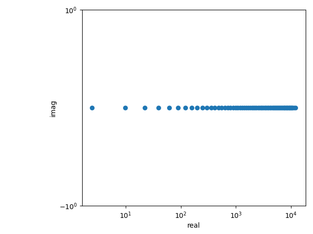
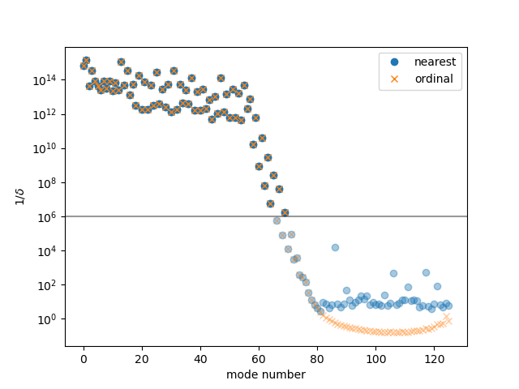

Getting Started
***************

eigentools comes with several `examples <https://github.com/DedalusProject/eigentools/tree/master/examples>`_ to get you started, but let's outline some basics in a very simple problem, the 1-D wave equation with :math:`u = 0` at both ends.
This is not quite as trivial a problem as it might seem, because we are expanding the solution in Chebyshev polynomials, but the eigenmodes are sines and cosines. 

.. code-block:: python
                
    from eigentools import Eigenproblem
    import dedalus.public as de
    
    Nx = 128
    x = de.Chebyshev('x' ,Nx, interval=(-1, 1))
    d = de.Domain([x])
    
    string = de.EVP(d, ['u', 'u_x'], eigenvalue='omega')
    string.add_equation("omega*u + dx(u_x) = 0")
    string.add_equation("u_x - dx(u) = 0")
    string.add_bc("left(u) = 0")
    string.add_bc("right(u) = 0")
    
    EP = Eigenproblem(string)
    EP.solve(sparse=False)
    ax = EP.plot_spectrum()
    print("there are {} good eigenvalues.".format(len(EP.evalues)))
    ax.set_ylim(-1, 1)
    ax.figure.savefig('waves_spectrum.png')

    ax = EP.plot_drift_ratios()
    ax.figure.savefig('waves_drift_ratios.png')

That code takes about 10 seconds to run on a 2020 Core-i7 laptop, produces about 68 "good" eigenvalues, and produces the following output:

eigentools has taken a Dedalus eigenvalue problem, automatically run it at 1.5 times the specified resolution, rejected any eigenvalues that do not agree to a default precision of one part in :math:`10^{-6}` and plotted a spectrum in six extra lines of code!           

Most of the plotting functions in eigentools return a :code:`matplotlib` :code:`axes` object, making it easy to modify the plot defaults.
Here, we set the :math:y`-limits manually, because the eigenvalues of a string are real.
Try removing the :code:`ax.set_ylim(-1, 1)` line and see what happens.

Mode Rejection
--------------
One of the most important tasks eigentools performs is spurious mode rejection. It does so by computing the "drift ratio" [Boyd2000]_ between the eigenvalues at the given resolution and a higher resolution problem that eigentools automatically assembles. By default, the "high" resolution case is 1.5 times the given resolution, though this is user configurable via the :code:`factor` keyword option to `Eigenproblem()`.

The drift ratio :math:`\delta` is calculated using either the **ordinal** (e.g. first mode of low resolution to first mode of high resolution) or **nearest** (mode with smallest difference between a given high mode and all low modes). In order to visualize this, :code:`EP.plot_drift_ratios()` in the above code returns an :code:`axes` object making a plot of the *inverse drift ratio* (:math:`1/\delta`),

Good modes are those *above* the horizontal line at :math:`10^{6}`; bad modes are also grayed out. In this case, the **nearest** and **ordinal** methods produce identical results. If the problem contains more than one wave *family*, **nearest** typically fails. For an example, see the `MRI example script <https://github.com/DedalusProject/eigentools/blob/master/examples/mri.py>`_. Note that **nearest** is the default criterion used by eigentools.

.. [Boyd2000] Boyd, J (2000). "Chebyshev and Fourier Spectral Methods." Dover. `<http://www-personal.umich.edu/~jpboyd/aaabook_9500toc.pdf>`_
